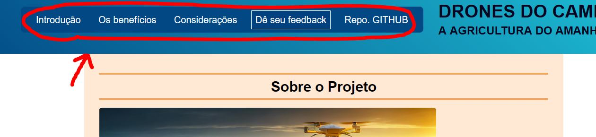

# Drone do Campo

## Sobre o projeto
Nosso site é sobre um projeto para ajudar na agricultura usando drones para dispersão de sementes. Nosso objetivo é aumentar a eficiência e precisão no plantio, especialmente em áreas de difícil acesso. Com drones, conseguimos cobrir grandes áreas de forma rápida e uniforme, economizando tempo e mão-de-obra, além de maximizar o potencial de crescimento das plantas.
Utilizaremos drones equipados com mecanismos de dispersão de sementes e software de planejamento do trajeto de voo. Isso nos permite adaptar o plantio as condições do terreno e clima, garantindo que cada semente seja plantada no local ideal. Para mais informações é só acessar o link de nosso site https://agrinho-isa-ale.vercel.app/

## Instruções de como usar (ㅋㅋㅋ)
O site é de fácil uso e intuítivo. No topo dele tem uma barra de navegação que pode te auxiliar a chegar no assunto que interessa para você.

